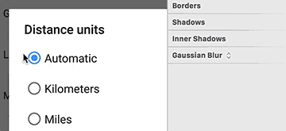

# Swap Styles
A little plugin for swaping styles between 2 layers in Sketch. Don't ```⌘ ⌥ c```/```⌘ ⌥ v``` endlessly, just have a little ```⌘ ^ s``` (cmd + ctrl + S).

Like this


And this


Or maybe this



## How to Install
1. Download and open ```swap-styles-master.zip```
2. Open ```Swap Styles.sketchplugin``` (Sketch will automatically install the plugin)

## Notes
* Tested on Sketch 3.3.2
* Works with shape and text layers
* Swaps layers' fills, borders, shadows, blur, opacity and blend mode
* Zoom blur's origin is always reset upon swapping :<
